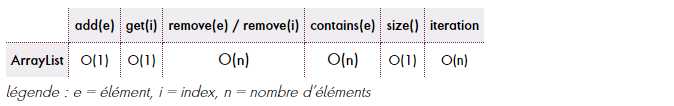
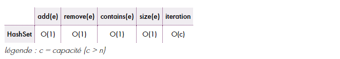
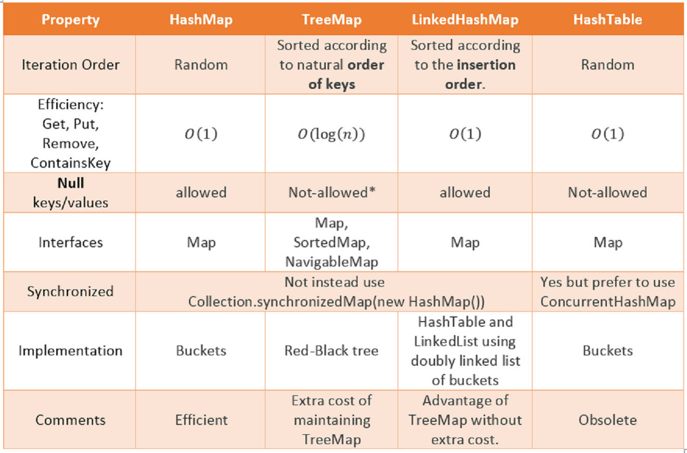

# Collections & Iterator

Iterable : Iterator (hasNext() et next())

Collections : Interface Collection<E> extends Iterable<E>  
- List : ArrayList, LinkedList, Vector
- Set : HashSet, SortedSet, TreeSet
- Queue : PriorityQueue, ArrayDeque
  + ArrayDeque : D pour double queue, permet d'ajouter dans les deux sens : debut et fin 
  + PriorityQueue : gérer des priorité, par exemple GEstion des processus dans un OS 

Map: interface Map<K,V>   
HshMap, SortedMap, TreeMap, Hashtable,


# Table de hachage  :  Big O
Map est une une table de Hashage

## Context
Parcouris une liste pour vérifier un email si il existe, est très déconseillé, surtout pout des big List
Cela s'appelle le Big O : `O(n)`

La notation `Big O` est un concept de complexité algorithmique qui permet d'évaluer les performances des algorithmes en
termes de temps d'exécution (temps de calcul) et d'utilisation de la mémoire (espace mémoire). En Java, la notation
"Big O" est utilisée pour décrire la complexité temporelle et spatiale des algorithmes, en fonction de la taille de
l'entrée (généralement notée "n").

- `Notation "Big O"` : La notation "Big O" est notée comme "O(f(n))", où "f(n)" est une fonction qui décrit la croissance
  du temps d'exécution ou de l'espace mémoire en fonction de la taille de l'entrée "n". Par exemple, "O(1)" signifie
  que l'algorithme a une complexité constante, tandis que "O(n)" signifie une complexité linéaire.

- `Temps d'Exécution` : La notation "Big O" est souvent utilisée pour évaluer la complexité temporelle d'un algorithme,
  c'est-à-dire combien de temps il prend pour s'exécuter en fonction de la taille de l'entrée. Par exemple, un
  algorithme "O(n)" prendra proportionnellement plus de temps à mesure que "n" augmente
- `Espace Mémoire` : La notation "Big O" peut également être utilisée pour évaluer la complexité spatiale, c'est-à-dire
  la quantité de mémoire utilisée par un algorithme en fonction de la taille de l'entrée. Par exemple, un algorithme
  "O(1)" utilise une quantité constante de mémoire, tandis qu'un algorithme "O(n)" utilise plus de mémoire à mesure
  que "n" augmente.
- Exemples : Voici quelques exemples courants de notations "Big O" en Java :

  + "O(1)" : Complexité constante (temps ou espace) indépendante de la taille de l'entrée.
  + "O(log n)" : Complexité logarithmique (par exemple, la recherche binaire).
  + "O(n)" : Complexité linéaire (par exemple, parcourir un tableau).
  + "O(n^2)" : Complexité quadratique (par exemple, une boucle imbriquée).


## Comment implémenter une table de hachage ?
Les tables de hachage sont des tableaux.    
On y stocke des données à un emplacement déterminé par une fonction de hachage.
La fonction de hachage prend en entrée une clé (ex. : une chaîne de caractères) et retourne en sortie un nombre.
Ce nombre est utilisé pour déterminer à quel indice du tableau sont stockées les données.
Une bonne fonction de hachage doit produire peu de collisions, c'est-à-dire qu'elle doit éviter de renvoyer le même nombre pour deux clés différentes. Il existe des algorithmes (par ex MD5, SHA1, SHA2) pour « hacher » des données.
En cas de collision, on peut utiliser l'adressage ouvert (recherche d'une autre case libre dans le tableau) ou bien le chaînage (combinaison avec une liste chaînée).


## Map : Table de hachage
Une table de hachage (ou "hash table" en anglais) est une structure de données qui permet de stocker et d'organiser
des données de manière efficace. 
Elle utilise une fonction de hachage pour associer des clés (keys) à des valeurs.       
(values) et permet un accès rapide aux valeurs en fonction de leurs clés. En Java, l'implémentation la plus courante
d'une table de hachage est la classe HashMap de la bibliothèque standard.


Voir les méthodes :

- getOrDefault (key, Object to return )
- replace(key, new Value)
  La map aussi propose trois méthodes pour itérer la Map ;
- entrySet
- KeySet

```java
for (Map.Entry<String,BankAccount2> entry:  bankAccounts.entrySet()) {
System.out.println(entry.getKey() + "="+entry.getValue());
}
for (var value: bankAccounts.entrySet() ) {
System.out.println(value.getKey() + "="+value.getValue());
}

for (var key: bankAccounts.keySet() ) {
System.out.println(bankAccounts.get(key));
}
```  

### collision  :
L'élément clé est passé à une fonction de hachage qui transforme cette clé en une adresse mémoire (index) où la valeur
associée sera stockée. La fonction de hachage doit être déterministe, c'est-à-dire que pour une clé donnée, elle doit
toujours produire le même index.

>Cependant, plusieurs clés différentes peuvent aboutir au même index, ce qui est appelé
une collision


# Looper ou itérer des collection 
Utiliser l'interface : `Iterator`  et `Iterable`  
Iterable contient une methode   qui renvoie une intervace Iterator

> Iterator<T> iterator();

# Java Collection Performance
Deux complexités sont couramment exprimées dans le domaine informatique, **complexité en temps et en mémoire**. Dans ce but,
des symboles portant une indication chiffrée entre parenthèses sont utilisés
Cet article traite de la complexité en temps et utilise le symbole O — limite supérieure — pour ce faire.

+ O(n) — temps linéaire — indique la nécessité de parcourir chacun des n éléments d’une collection (dans le pire
des cas) pour y réaliser une opération ;
+ O(log n) — temps logarithmique — indique que, plus le nombre d’éléments est élevé, plus la complexité d’une 
opération se tasse ; (brute-force)
+ O(1) — temps constant — indique que, quel que soit son nombre d’éléments, l’opération aura toujours un coup 
similaire

Exemple :   
Cette liste est donc toute désignée lorsqu’il s’agit d’itérer sur des éléments ou d’y accéder par index. Mais,
dès lors qu’une suppression ou une recherche est nécessaire, il faudra s’en remettre à une autre collection ; 
pourquoi pas au matheux de la bande : HashSet. 

  

   




