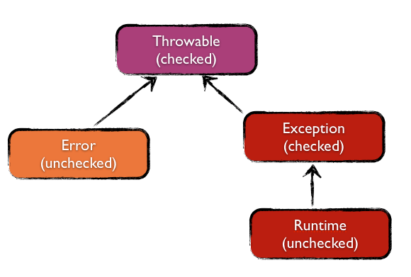
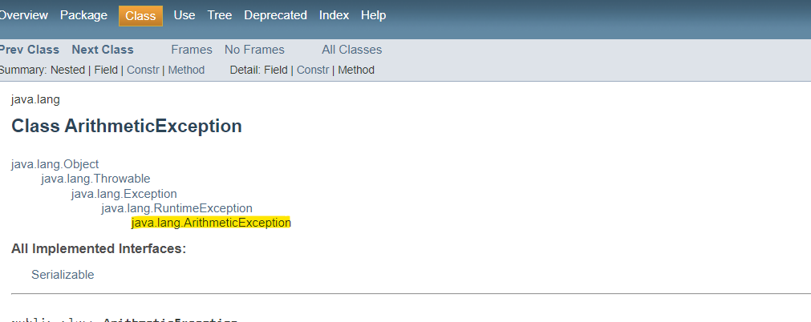

# Exception 

## Architecture 



Exemple arboresence : ArithmeticException   



## Types   

- **Checked**  :  
Des exceptions qui faut gérer dans le code. C'est des exceptions qui sont vérifiés lors
de la compilation.  
Cela concerne les exceptions de type : `Exception`    

*Exemple* : 
   + FileNotFoundException  
   + XMLSignatureException
   + XMLStreamException
   + XPathException
  
- **Unchecked**   :
Java nous n'impose pas de les gérer.  
Cela concerne les exceptions de type : `RuntimeException`    

*Exemples* : 
   + NullPointerException
   + IndexOutOfBoundsException
   + IllegalArgumentException  
   + ArithmeticException

- **Error**   
Des errors qui se font d'une façon externe de l'application.    
Exemples :  
    + OutOfMemoryError 
    + StackOverflowError   

## AutoCloseable : try-with-resources 
AutoCloseable allows a class to be used as a resource of the `try-with-resources` construct introduced in Java 7
 interface (such as java.io.Closeable or java.sql.Connection.   

Methode close de l'interface AutoCloseable ::: 

```java
public interface AutoCloseable {
    void close() throws Exception;
}
```
> The close() method of an AutoCloseable object is called automatically when exiting a try-with-resources block for which 
the object has been declared in the resource specification header. This construction ensures prompt release, avoiding 
resource exhaustion exceptions and errors that may otherwise occur.

les interfaces existentes : 
- java.io.Closeable 
- java.sql.Connection


