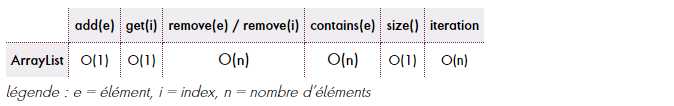
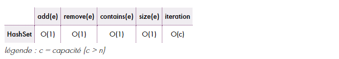
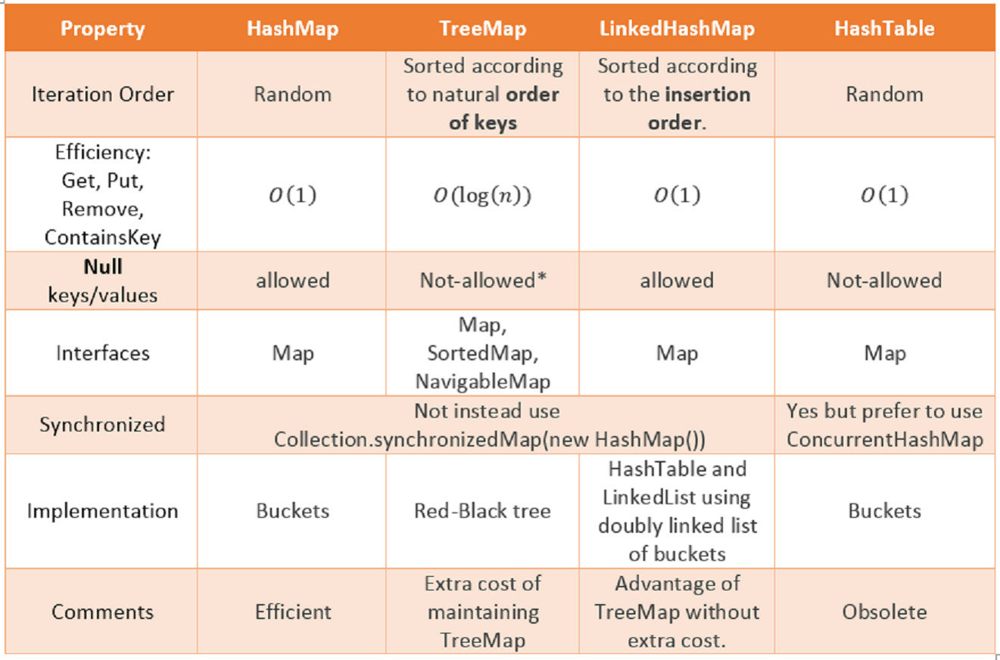

# • Java Collection Performance
Deux complexités sont couramment exprimées dans le domaine informatique, **complexité en temps et en mémoire**. Dans ce but,
des symboles portant une indication chiffrée entre parenthèses sont utilisés
Cet article traite de la complexité en temps et utilise le symbole O — limite supérieure — pour ce faire.

+ O(n) — temps linéaire — indique la nécessité de parcourir chacun des n éléments d’une collection (dans le pire
des cas) pour y réaliser une opération ;
+ O(log n) — temps logarithmique — indique que, plus le nombre d’éléments est élevé, plus la complexité d’une 
opération se tasse ; (brute-force)
+ O(1) — temps constant — indique que, quel que soit son nombre d’éléments, l’opération aura toujours un coup 
similaire

Exemple :   
Cette liste est donc toute désignée lorsqu’il s’agit d’itérer sur des éléments ou d’y accéder par index. Mais,
dès lors qu’une suppression ou une recherche est nécessaire, il faudra s’en remettre à une autre collection ; 
pourquoi pas au matheux de la bande : HashSet. 

  

   

