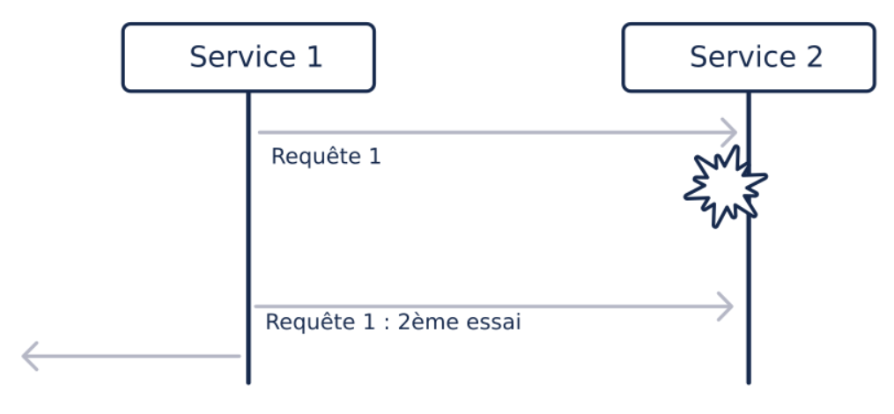

# Retry Pattern  
Il consiste à envoyer à nouveau la requête qui a échoué. Et donc si le service appelé “tombe en marche”, cela sera
transparent pour l’utilisateur au prix d’une latence significative.

Par contre,si le service appelé reste hors service, l’application risque une surcharge en multipliant les requêtes.

Lors de l’appui sur le bouton d’accélération, nous envoyons l’ordre d’accélérer de 5km/h. Pour une raison  quelconque,
la requête n’arrive pas tout de suite et donc notre pattern envoie un deuxième ordre d’accélérer de 5km/h. 
Résultat au lieu d’accélérer de 5km/h nous accélérons de 10km/h.

    -> La bonne solution aurait été d’envoyer l’ordre idempotent : passe à 110km/h. Dans ce cas peu importe le nombre
       d’ordres reçus.
