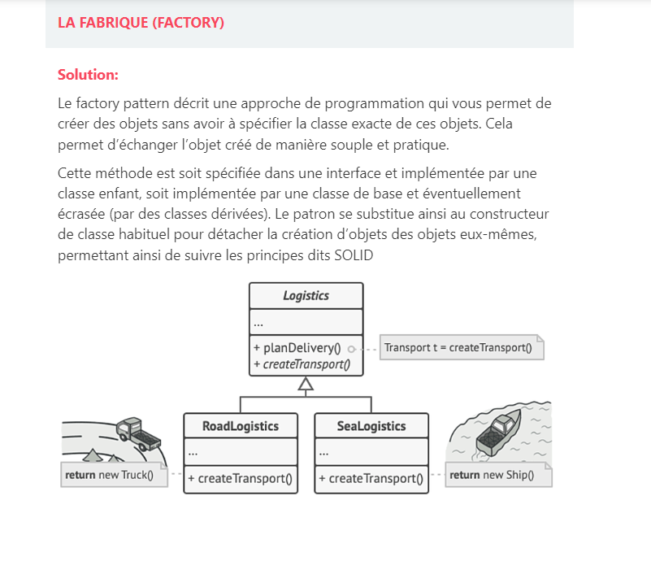

# c'est quoi ?
Le design pattern est un arrangement de modules qui répond à un problème de conception d’un logiciel en programmation
orienté objet.  Il décrit grossièrement la solution qui pourra être adaptée en

Il existe trois types de design pattern : les créateurs, les structuraux et les comportementaux.  

- créateurs : 
Les créateurs définissent l’instanciation et la configuration des objets et classes. 
    - Singleton 
    - Prototype
    - Fabrique 

- structuraux 
Les structuraux aident à résoudre les problèmes de structure des classes et de leur interface. 
  - Façade 
  - Adaptateur 
  - Proxy 
  - décorateur 

- comportementaux
Les comportementaux définissent l’organisation des objets afin que les responsabilités soient réparties entre eux.
  - Commande
  - Itérateur 
  - Observateur 
  - Stratégie 

# Les patrons de création

## SINGLETON
Notre application a besoin d’une et une seule instance d’un objet.
De plus, nous voulons fournir un seul point d’accès global à cette instance    
Toute mise en place d’un singleton est constituée des deux étapes suivantes :    
- Rendre le constructeur par défaut privé afin d’empêcher les autres objets d’utiliser
l’opérateur new avec la classe du singleton.
- Mettre en place une méthode de création statique qui se comporte comme un constructeur. En sous-main, cette méthode appelle le constructeur privé pour créer un objet et le sauvegarde dans un attribut statique. Tous les appels ultérieurs à cette méthode retournent l’objet en cache.

## Fabrique ou Factory 
Le pattern « fabrique » (factory) permet de créer des instances en cachant le type concret des instances créées
Problème :   
Une application peut utiliser  :
- une base locale MySQL si l’ordinateur n’est pas connecté à Internet,
- ou une base Oracle distante s’il est
connecté

Solution :   
  aoStylo dao = fabriqueDaoStylo.getDao();‰

  - Dao sera du type DaoStyloOracle ou DaoStyloMySQL selon le cas‰
  - DaoStylo est une interface implémentée par les classes concrètes de DAO DaoStyloOracle et DaoStyloMySQL‰
  - Signature de getDao() :
    DaoStylo getDao()
Pour fixer le type renvoyé, il suffit de l’indiquer auparavant à la fabrique par le code fabrique DaoStylo .setTypeDao(typeDao);
typeDao peut, par exemple, être déterminé en testant si l’ordinateur est connecté ou non à Interne

## LE MONTEUR (BUILDER)
permet de séparer la construction d’un objet de sa représentation. Il est très utile pour créer, à partir d’un même
processus, des représentations différentes.

## Prototype 
Plutôt que de créer un objet de A à Z c'est à dire en appelant un constructeur, puis en configurant la valeur de ses 
attributs, ce patron permet de créer un nouvel objet par recopie d'un objet existant. 

# Les patrons Structurels  
## LE DÉCORATEUR (DECORATOR)
Problématique :    
Imaginons que l’on souhaite ajouter un ou plusieurs comportements à une classe existante. Le plus simple est d’ajouter 
directement les comportements voulus à la classe, mais plusieurs raisons peuvent empêcher de faire cela :
- Ne pas casser le principe de responsabilité unique.    
- Comportements communs à plusieurs classes (dans ce cas, il est peut-être plus judicieux de créer un nouvel objet que 
l’on va intégrer dans les classes en ayant besoin).   
- Comportements nécessitant d’être réversibles, configurables ou débrayables
- Présence de tests (qui devront donc être mis à jour suite à l’ajout des nouveaux comportements).

Solution:    
Ce patron de conception Décorateur (Decorator) permet d’apporter de nouvelles responsabilités (fonctionnalités ou
comportements) à un objet existant.    
Il fonctionne via une interface, qui est implémentée à la fois par l’objet décoré et les objets qui le décorent.    
L’inconvénient de ce pattern est qu’il peut complexifier la construction de l’objet, en particulier si celui-ci dispose
de nombreuses décorations. Cela peut-être corrigé via l’utilisation du pattern Builder.   

## Proxy  _ LA PROCURATION (PROXY)
permet de fournir à un tiers objet un mandataire, pour contrôler l’accès à cet objet  

Exemples :   
- Afin d’améliorer la performance, le scénario de lazy loading d’hibernate est basé sur le pattern proxy (construit dynamiquement en étendant la classe de domaine), ce qui permet de récupérer les données à la demande
- Spring crée un proxy pour chaque class annoté @Configuration

# Les patrons comportementeaux 
## L'ADAPTATEUR (ADAPTER)
Problématique :  
Comment accéder à des objets de l’extérieur quand on utilise une conception de type Domain Driven Design ?
Les interfaces exposées pour l’accès au métier ne correspondent pas exactement avec ce qu’attend notre code.  

Solution :   
**Pattern Adapter**   
On est dans le cas où on a une interface pour accéder au métier non compatible avec notre code.   
Dans ce cas on se retrouve alors dans une architecture de type hexagonale : DDD + ports + pattern adapter   
**Adapter** fonctionne comme un pont entre 2 interfaces incompatibles. Ce pattern implique une classe qui est
responsable de faire la jointure entre les fonctionnalités d’interfaces indépendantes.   
On doit mettre en place ce pattern lorsqu’on a une classe existante dont l’interface n’est pas compatible avec 
notre code.  

## LE PATTERN STRATÉGIE (STRATEGY)
Problématique :   
Comment faire différentes opérations avec un seul et même objet ? Faire une classe avec toutes les opérations possibles 
violerait le Single Responsability Principle.   

Solution : le pattern stratégie    
Il propose de prendre une classe dotée d’un comportement spécifique, mais qui l’exécute de différentes façons, et de 
décomposer ses algorithmes en classes séparées appelées stratégies.   

Le pattern permet donc de réaliser plusieurs opérations avec un seul et même objet. On implémente alors une stratégie 
différente par variante de notre opération. On respecte alors le **Single Responsibility Principle**. Aussi comme le but 
est de créer une classe qui étend notre interface Strategy pour implémenter un nouveau comportement On respecte ainsi
le **Open/Closed Principle**. Chaque sous classe de strategy implémentent une interface et donc ça satisfait au
**principe de substitution de Liskov**. On dépend des abstractions et non des implémentations, on respecte le **Dependency
inversion principle**    
Dans JPA, le fetch type (EAGER / LAZY) des entités implémentent des stratégies différentes de récupération des objets.   

Exemple :  
On est sur notre site de e-commerce préféré. Au moment du passage en caisse plusieurs options de paiement pour l’article sont disponibles.
Le pattern Strategy semble adapté à notre besoin !   

