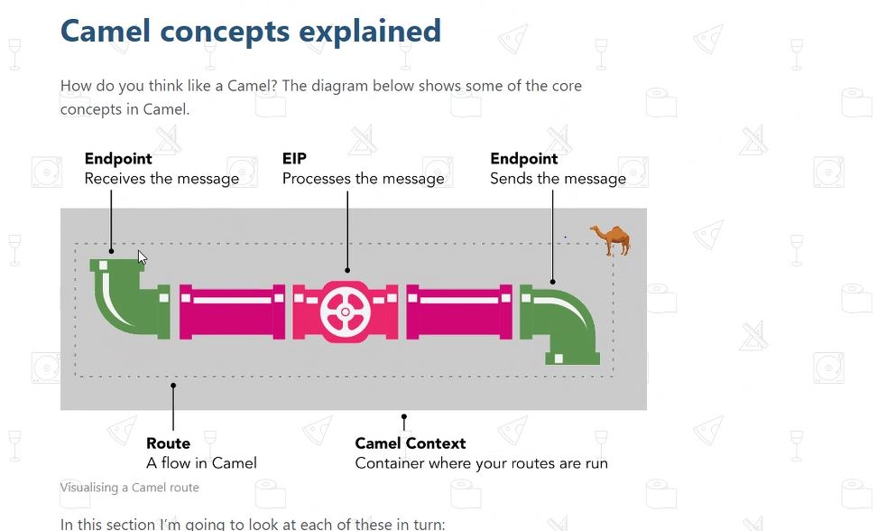

# EIP -  Entreprise Integration Patterns   
on parle de frameworks d’intégration ou encore de « lightweight ESB ». Ils implémentent les Patterns d’Architecture de l’Intégration proposés dans l’ouvrage devenu 
référence Entreprise Integration Patterns. (ou EIP)

Exemple de framework : 

- Spring integration 
- Apache Camel 

# Apache Camel 

