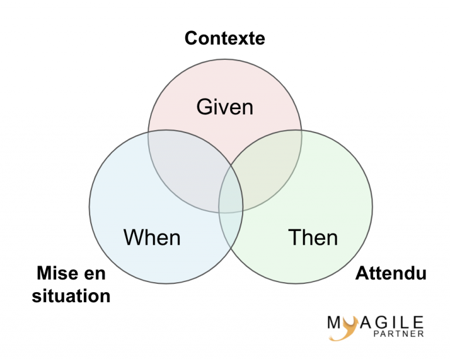

## c'est quoi cucumber ?  
An automation tool for Behavior-Driven Development (BDD) 
The specifications are written in plain texts (**Gherkin**), which allows them to be easily
understandable for all stakeholders.  
Utilisation de la syntaxe  :   Given, When, Then, And and But   
en français cela se traduira par :  étant donn, quand, alors, Et , Mais.

Des pratiques de développement logiciel comme le **BDD** ou l’**ATDD**, utilisent ce langage pour la description
des comportements attendus.

Exemple 

    ```
    Scenario : affichage du prix du produit

    Etant donné que je navigue sur le site ecommerce
    Quand j’affiche une fiche produit
    Et que ce produit a une promotion de « 0 » %
    Alors le prix affiché du produit ne change pas
    
    Etant donné que je navigue sur le site ecommerce
    Quand j’affiche une fiche produit
    Et que ce produit a une promotion de « 20 » %
    Alors le prix affiché du produit est de « -20% »
    Et une mention « promotion -20% » rappelle la promotion
    ```


 
